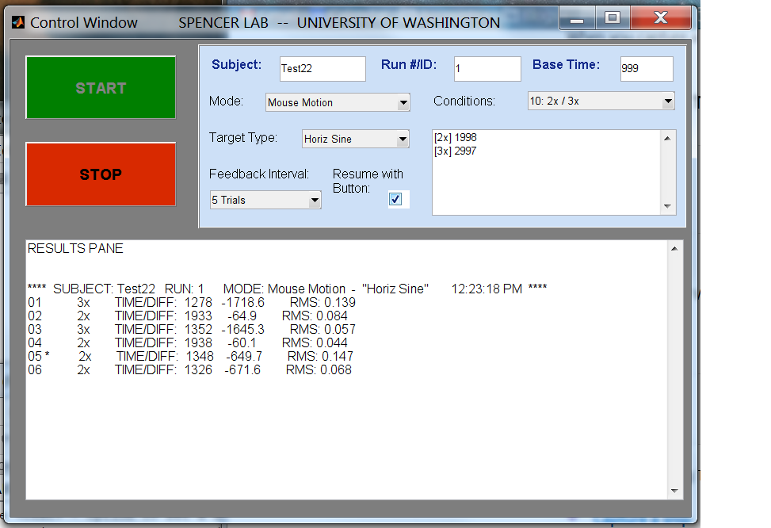
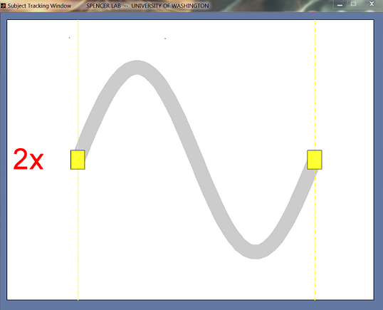

# Speech and Motor Timing Assessment

This is a MATLAB graphical-user interface written for a study to measure the timing accuracy of two different motor tasks: fine hand motion and speech production. Both normal and Parkinson's disease subjects participated in the study, with the objective of examining the degree of correlation for the two types of tasks. Testing was conducted at the University of Washington, with funding provided by the National Institute on Deafness and Other Communication Disorders (NIH-NIDCD) and a University of
Washington Royalty Research Fund (P.I>: K. Spencer).

## Overview of software

The GUI was written in MATLAB, with support from the _data acquisition toolbox_.  It provides an interface for the test subject as well as the person running the experiment (i.e. the "controller").

### The Control Window

From the MATLAB command console, the first step is to launch the main control panel by typing _TrackControl_. (The path should contain all .m and .fig files appearing in the list below.) The GUI window opened looks like this:

From this panel, the exerimenter enters the subject ID and description of the run, usually a unique number ordered consecutively across test sessions. The controller then chooses the type of experiment ("Mouse Motion" or "Speech") and the related task target (Horizontal or Vertical sinewaves for the mouse task, and one of two short sentences for the speech task) from the drop-down menus. The controller should also choose the timing sequence of the run in the _Conditions_ pull-down menu. Initially, a "practice" session is first conducted to establish the natural baseline timing of the task for a particular test subject; from that baseline (which can be entered in the top-right field), the 2x and 3x timing targets are automatically calculated. If a non-practice condition is chosen, a feedback interval should also be chosen, giving the subject an indication of how close their timed motor task came to the target.

When the run is setup, the controller presses the "START" button to open up the Subject Tracking Window.

### The Subject Tracking Window

Designed for two monitors, so may not look correct on yours!

### File descriptions

### Copyright Information

This program was written by Steven Bierer at the University of Washington in 2011. Please contact him at neurolaunch@gmail.com if you intend to use the software, modified or not.
