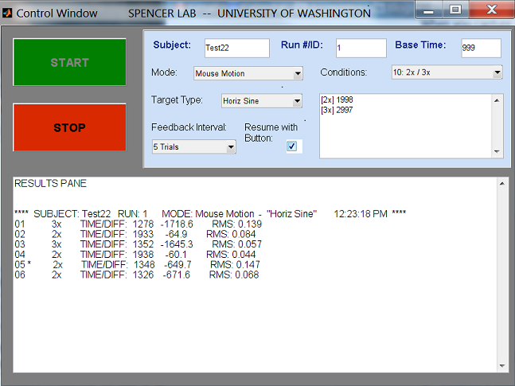

# Speech and Motor Timing Assessment

This is a MATLAB graphical-user interface created for a study to measure the timing accuracy of two different motor tasks: fine hand motion and speech production. Both normal and Parkinson's disease subjects participated in the study, with the objective of examining the degree of correlation for the two types of tasks. Testing was conducted at the University of Washington, with funding provided by the National Institute on Deafness and Other Communication Disorders (NIH-NIDCD) and a University of
Washington Royalty Research Fund (P.I.: K. Spencer).

## Overview of software

The GUI was written in MATLAB, with support from the _data acquisition toolbox_.  It provides an interface for the test subject as well as the person running the experiment (i.e. the "controller"). Besides the DAQ toolbox, the computer should also have a supported audio card and microphone placed in front of the test subject. It is also recommended that the test subject has his/her own mouse, separate from the controller's.

### The Control Window

From the MATLAB command console, the first step is to launch the main control panel by typing _TrackControl_. (The path should contain all .m and .fig files appearing in the list below.) The GUI window opened looks like this:

From this panel, the exerimenter enters the subject ID and description of the run, usually a unique number ordered consecutively across test sessions. The controller then chooses the type of experiment ("Mouse Motion" or "Speech") and the related task target (Horizontal or Vertical sinewaves for the mouse task, and one of two short sentences for the speech task) from the drop-down menus. The controller should also choose the timing sequence of the run in the _Conditions_ pull-down menu. Initially, a "practice" session is first conducted to establish the natural baseline timing of the task for a particular test subject; from that baseline (which can be entered in the top-right field), the 2x and 3x timing targets are automatically calculated. If a non-practice condition is chosen, a feedback interval should also be chosen, giving the subject an indication of how close their timed motor task came to the target.

When the run parameters are set up, the controller presses the "START" button to open up a Subject Tracking Window.

### The Subject Tracking Window

This panel is intended for display on a second monitor (thus, it may not appear correctly when run on a single monitor), in front of which is the test subject. There are two variants. After the subject presses a green button to indicate readiness, the speech task window displays a prompt for the short phrase (e.g. "Buy Bobby a Poppy") that the subject then speaks. The utterance is recorded via a microphone, automatically shutting off when the speech energy gets low enough.  The window for the mouse motion task, shown below, displays a horizontally or vertically oriented sinusoid. During this task, the subject uses the mouse to press the yellow square on the left (or top) then moves the cursor to follow the sinewave.

The timing information for each trial of the run is displayed in the control window's "Results Pane" for the experimenter to view (see top figure). When the chosen number of trials is completed, control of the program goes back to this window. The run can be terminated at any time by pressing the STOP button, or by clicking on the top right "X" of the subject tracking window. (Currently, early termination does not end the program smoothly.)

Data for each run is automatically saved in the workspace variable 'resultStruct', and the set-up parameters for the run are saved in the variable 'runInfo'. The data is also saved in MATLAT (.mat) and Excel (.xls) format using a naming convention based on the subject id and run number.

### File descriptions

TrackControl.m, TrackControl.fig: Main GUI program, used to launch TrackSpeech and TrackSubject

TrackSpeech.m, TrackSpeech.fig: Subject GUI window for the speech task

TrackSubject.m, TrackSubject.fig: Subject GUI window for the mouse-motion task

TrackControl_PlotFeedback.m: Generates plot of actual and target times of the subject's responses, at the chosen feedback interval.

sptest_2.mat, sptest_2.xls: Example data files from a long-ago run of the experiment in speech mode.

## Permission for use

This program was written by Steven Bierer at the University of Washington in 2011. Please contact him at neurolaunch@gmail.com if you intend to use the software, modified or not.

Presented data or analysis made using the software should reference the following journal article: Weir-Mayta P, Spencer KA, Bierer SM, Daliri A, et al.  Investigation of Feedback Schedules on Speech Motor Learning in Older Adults. International Journal of Aging Research. 2019. (https://escipub.com/ijoar-2019-03-2006/)
